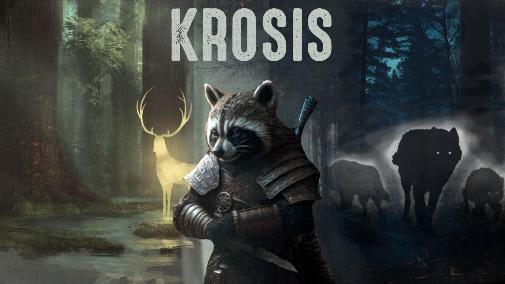

# Krosis Changelog

## Krosis v0.8

- Fixed dialogue bugs (no interactions)
- Fixed navmeshes in Whiterun
- Removed _Dawn Of Skyrim - Modern Patches_ due to broken navmeshes
- Added _FDE - Jordis_
- Added _Complete Alchemy and Cooking Overhaul_ and nessesary patches
- Added _Complete Crafting Overhaul Remastered_ and patched all recipies + some balance patches for added items
- Fixed missing dialogue bug + bug with looting
- Updated _Plus Combat - A Modern Combat Overhaul_
- Added _Marked Treasure SSE_
- Added _FDE - Erik The Slayer_
- Fixed dark face when completing Mage's College
- Added a bunch of vanilla quest expansions (Save The Icerunner, Blood On The Ice Redux etc.)
- Added some 3BA presets to OBody pool
- Added _Honed Metal Additional Materials UPDATED_
- Fixed Companions quest
- Added _Quick Light SE_
- Fixed absurd high armor rating (and Miraak fight as well)
- Fixed some priest models
- Replaced _Optimal Salves Hotkey MCM_ with _Swift Potion NG_
- Improved stability and other minor fixes with smp
- Updated some minor mods
- Moved _Armor Rating Recalculator_ to optionals since it can make some boss fights insanely difficult even on adept
- Added alternate perspective additions
- Added _Faithful Faces CC_
- Downgraded NPC skin to 2k
- Added _Modular Mage_ outfit
- Added _Definitely Not A Furry Animations (Woofs)_
- Updated translations
- Added some new replacers for NPC
- Added _Meridia's Order_ questline
- Added _Metallurgy_ retextures
- Added _Wyrmstooth_
- Added _Falskaar_
- Added _Konahrik's Accoutrements_
- Added _The Gray Cowl of Nocturnal SE_
- Added _The Tools of Kagrenac_
- Added _DudelSaur's Bone Wolf Expansion_
- Added _Teldryn Serious - A Teldryn Sero Backstory Quest SSE_
- Added _Project AHO_
- Added _Saints & Seducers EC_
- Added LOTD and a lot of patches
- Patched almost all new added quests
- LODs rebuilded to include new lands
- Overhauled Dawnguard and Dragonborn DLC
- Added _Twinblades of Skyrim_ and movesets
- Regenerated synthesis and patched sounds
- Added some settings that i forgot to add
- Added _FDE - Lydia_
- Added _Dryads - Mihail Monsters and Animals (SE-AE version) (''spriggan'')_
- Added _OBody NG Configuration File with Base CBBE and HIMBO Presets Blacklisted_
- Replaced some texture replacers to be more perfomance friendly
- Fixed freeze in fallowstone cave
- Fixes for OWL (merged patch for all new weapons)
- Added _Heavy Armoury_
- Another try to fix CTD
- Added _Sunhelm_ as optionals

## Krosis v0.7

- Updated translations
- Updated _OStim Community Resource_
- Added _Open Animations 3PP_
- Reran Pandora to add Elden Counter behaviors to the engine
- Added _Eclipse Mage Outfit HDT-SMP_ and SPID distribution
- Added 8-way dodge, thanks to Dynamic Dodge
- Added a hella bunch of new armors and some SPIDs as well
- Added new weapons and patches for OAR
- Updated _Racial Skin Variance_
- Added new animations
- Added _Unread Books Glow MCM_
- Added _Left Hand Rings_
- Added new recordings to MCM Recorder
- Updated some of TrueHUD settings for the bosses
- Patched OWL lists for consistency with the added weapons
- Updated statues textures
- Included _OCPA_ in wj compiler settings
- Removed _Completionist_ due to inconsistances with UI
- Removed _Equipment Durability System NG_
- Removed _Perks Per Level_
- Fixed missing textures for draugrs
- Updated _SkyValor_
- Added _Magicka Flow - A Magicka Regeneration Overhaul_
- Updated _SkyValor - 4thUnknown's Creatures_ and patched some creatures to prevent CTD
- Added _Mihail Mods - SkyValor - Patch_ and patched some missing creatures as well
- Rebuild translations database from scratch
- Added _Smart Optimal Salves - Optimal Potion Hotkey MCM_
- Added _Experience - Synthesis Patcher_ and patched all new creatures to have consistency with _Experience_
- Reduced sprint movespeed
- Added _Menu Maid 2_
- Added a bunch of racemenu presets
- Nerfed _KS Dragon Overhaul 2_ dragons thanks to _KS Dragon Overhaul 2 Less Difficulty_ mod
- Added _Elder Creed - Movement II_ as default non-armor walk-run animations
- Fixed issues with _Ryan's Secunda's Kiss_ and _EmbersXD_ (temporary solution until CK time)
- Fixed incorrect _Skyshard_ LODs
- Removed _Elden Rim - Weapon Arts_ except base due to "overkill" and inconsistance mechanics for the Ashes Of War and combat overhaul
- Updated _SSE-AT_
- Added some 3BA presets to OBody pool
- Added dragon claws auto-unlock

## Krosis v0.6.1

- Updated _Northern Roads Patches_
- Fixed some textures in Helgen and Ryn's Overhauls
- Updated translations
- Fixed Equipment Physics when changing positions + added _CBPC Equipment physics - Real Tight config_
- Updated _SSE Engine Fixes_
- Removed _Dragonactorscript Infinite Loop Fix_ since _KS Dragons Overhaul_ contains their own fix
- Removed _SB - Better Blending Helgen Mud_ because it's not needed thanks to _AP_
- Removed some minor mods and fixes because it was worthless
- Added new Elisif replacer
- Removed Krosis Picturesque profile due to not supporting it for now

## Krosis v0.6

- Reverted Stances to MCM version
- COCKS squished interface fix
- Added optional OCPA
- Countless hours of patching OBIS, OWL and Modpocalypse to prevent dark face bug
- Added Skyrim Outfit System
- Removed CK from WJ file
- Removed BDOR armors male pack
- Added Know Your Enemy 2  as Optionals
- Added Wait Your Turn Sot Patch
- Updated translations
- Removed Combat Pathing Revolution + NG since at can cause CTD while changing cells and it is not working like it intented for AE update according to the mod author
- Added Elden Counter

## Krosis v0.5

Initial Release
