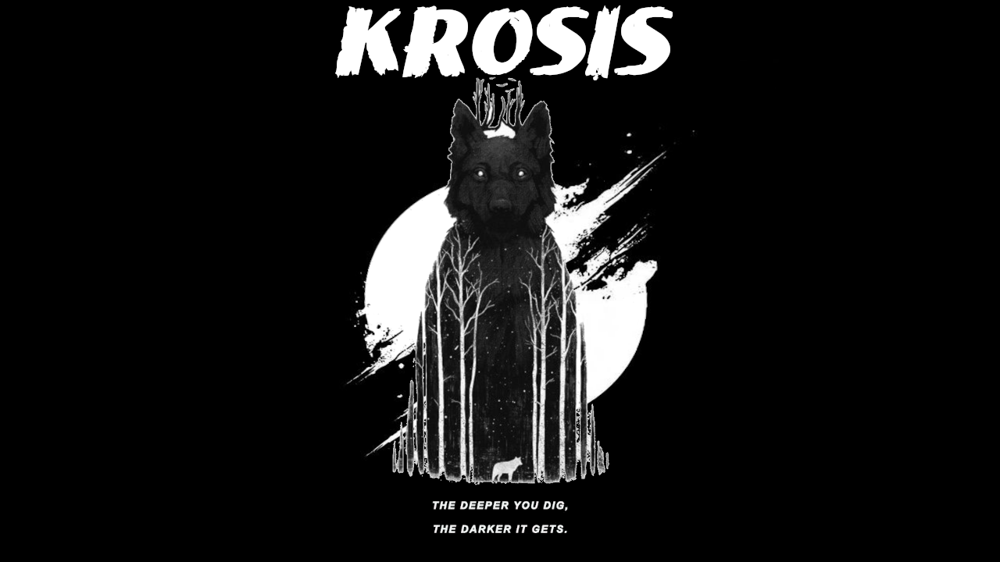

# 

## Krosis

THE DEEPER YOU DIG, THE DARKER IT GETS

## Krosis? What is it?

Skyrim modlist with beautiful graphics, NSFW and other additions for 1.6.1170 (WIP for now). Vokriinator Black, overhauled cities, non-fetish OStim Suite and immersion and quest mods. Full Jayserpa suite, Skyshards, variety of outfits for  NPC and more to come!

### Load Order

If you wish to look at full load order, it can be found [here](https://loadorderlibrary.com/lists/krosis-1). Here is some of noticeble mods:

- Environs
- Cities Of The North, The Great Cities and Towns, Redbag's Morthal
- JK's Skyrim, overhauled interiors
- Full parallax textures thanks to Skyland AIO, Enhanced Rock and Mountains, Majestic Landscapes with the terrain parallax fixes.
- Inigo, Lucien, Serana Dialogue Addon, Remiel and Xelzaz
- Racial Skin Variance textures, AI Overhaul, BeastHHBB, and extended dialogues.
- MCO + Valhalla Combat based fast paced combat, similiar to the Assassins Creed.
- Additional Animations

### System Requirements

The recommended setup for an enjoyable experience at 1080p is at least (probably, can be changed in future)

- intel i7 or AMD Ryzen 5600 or later
- NVIDIA RTX 2070 SUPER or AMD Radeon 5700 XT or later

### Base Requirements

- Nexus Account (premium is strongly recommended)
- Vector Plexius account
- LoversLab Account

## Installation

Before you do anything with _Wabbajack,_ ensure that _Skyrim_ is installed in a non-protected folder (such as the root of your drive, like `C:\`). It **cannot** be located in _Program Files_ or the list will not function. Relocate the game as necessary.

_Krosis_ requires the additional _Creation Club Content_ from the _Skyrim Anniversary Edition Upgrade_ or the modlist will not install. The price is about $20.

Create a directory on the root of one of your Solid State drives (such as `D:\Krosis`) where you wish the modlist to be installed. You need at least **500GB** free for this modlist and a few GBs in the _Wabbajack_ and _OS_ drives for caches. About half of these GBs are mod downloads; the downloads folder can be deleted or relocated after installation.

Ensure you have set antivirus exceptions for this folder, the _Skyrim_ vanilla game folder, and the _Wabbajack_ folder, or the installation will fail. Certain antivirus packages do not properly respect exceptions and cannot be fully disabled (_Webroot_ and _Bitdefender_ are examples of these). These tools must be uninstalled from your system.

Ensure that _OneDrive_ is **uninstalled** or **completely disabled.** This program locks some of _Skyrim_'s configuration files when in use and will cause the modlist to experience errors.

The _Microsoft Visual C++_ redistributable package is required for _Mod Organizer 2_ and you can download it from _Microsoft._ Download the x64 version under "Visual Studio 2015, 2017 and 2019" [here](https://aka.ms/vs/16/release/vc_redist.x64.exe).

You must set your Advanced Memory Pagefile to at least 40GB or the modlist will constantly crash. On _Windows 11_ you can find this setting in the About page for your PC. [Here](https://www.windowscentral.com/software-apps/windows-11/how-to-manage-virtual-memory-on-windows-11) is a document to find the specific option; other versions of Windows are similar. Setting the minimum and maximum pagefile size to `40,960` on one Solid State Drive is recommended.

## Launching the Modlist

WIP

## Removing the Modlist

You can just remove the Krosis folder
